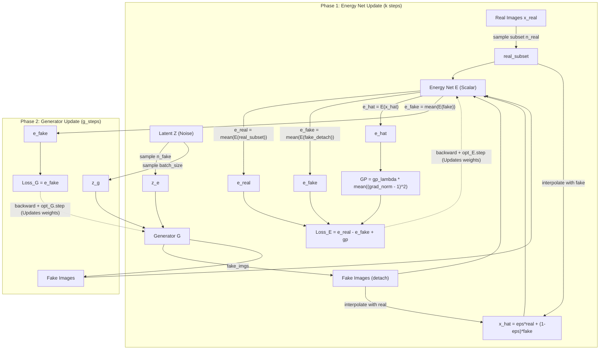

```mermaid
graph TD
    A["Real Images x_real"]
    B["Latent Z (Noise)"]
    G["Generator G"]
    E["Energy Net E (Scalar)"]

    subgraph P1["Phase 1: Energy Net Update (k steps)"]
        direction TB
        A -->|"sample subset n_real"| A1["real_subset"]
        B -->|"sample n_fake"| Z1["z_e"]
        Z1 --> G
        G -->|"fake_imgs"| F1["Fake Images (detach)"]
        A1 --> E
        F1 --> E
        E -->|"e_real = mean(E(real_subset))"| ER["e_real"]
        E -->|"e_fake = mean(E(fake_detach))"| EF["e_fake"]

        A1 -->|"interpolate with fake"| XH["x_hat = eps*real + (1-eps)*fake"]
        F1 -->|"interpolate with real"| XH
        XH --> E
        E -->|"e_hat = E(x_hat)"| EH["e_hat"]
        EH --> GP["GP = gp_lambda * mean((grad_norm - 1)^2)"]

        ER --> LE["Loss_E = e_real - e_fake + gp"]
        EF --> LE
        GP --> LE

        LE -.->|"backward + opt_E.step (Updates weights)"| E
    end

    subgraph P2["Phase 2: Generator Update (g_steps)"]
        direction TB
        B -->|"sample batch_size"| Z2["z_g"]
        Z2 --> G
        G --> F2["Fake Images"]
        F2 --> E
        E -->|"e_fake = mean(E(fake))"| EG["e_fake"]
        EG --> LG["Loss_G = e_fake"]

        LG -.->|"backward + opt_G.step (Updates weights)"| G
    end
```