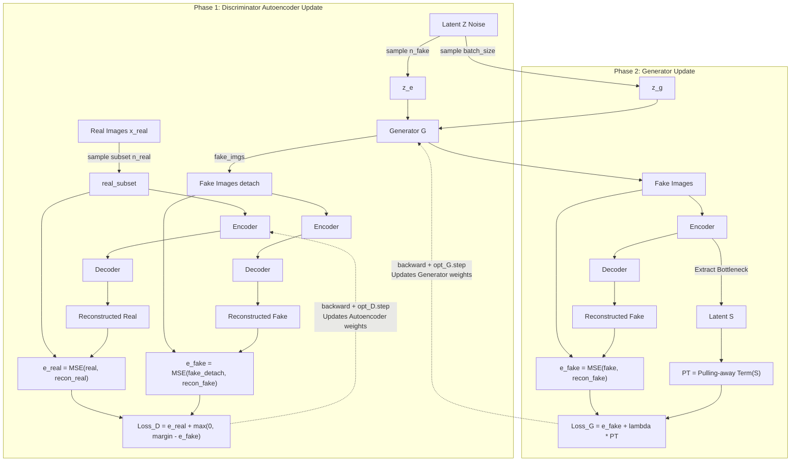

```mermaid
graph TD
    A[Real Images x_real]
    B[Latent Z Noise]
    G[Generator G]

    subgraph P1[Phase 1: Discriminator Autoencoder Update]
        direction TB
        A -->|sample subset n_real| A1[real_subset]
        B -->|sample n_fake| Z1[z_e]
        Z1 --> G
        G -->|fake_imgs| F1[Fake Images detach]

        A1 --> ENC_R[Encoder]
        ENC_R --> DEC_R[Decoder]
        DEC_R --> REC_R[Reconstructed Real]
        
        A1 --> MSE_R["e_real = MSE(real, recon_real)"]
        REC_R --> MSE_R

        F1 --> ENC_F[Encoder]
        ENC_F --> DEC_F[Decoder]
        DEC_F --> REC_F[Reconstructed Fake]
        
        F1 --> MSE_F["e_fake = MSE(fake_detach, recon_fake)"]
        REC_F --> MSE_F

        MSE_R --> LD["Loss_D = e_real + max(0, margin - e_fake)"]
        MSE_F --> LD

        LD -.->|backward + opt_D.step<br/>Updates Autoencoder weights| ENC_R
    end

    subgraph P2[Phase 2: Generator Update]
        direction TB
        B -->|sample batch_size| Z2[z_g]
        Z2 --> G
        G --> F2[Fake Images]

        F2 --> ENC_G[Encoder]
        
        ENC_G -->|Extract Bottleneck| S["Latent S"]
        S --> PT["PT = Pulling-away Term(S)"]

        ENC_G --> DEC_G[Decoder]
        DEC_G --> REC_G[Reconstructed Fake]

        F2 --> MSE_G["e_fake = MSE(fake, recon_fake)"]
        REC_G --> MSE_G

        MSE_G --> LG["Loss_G = e_fake + lambda * PT"]
        PT --> LG

        LG -.->|backward + opt_G.step<br/>Updates Generator weights| G
    end
```